Logistic Regression on Heart Disease Data
================
Tapas Mishra
8 April 2019

  - Logictic Regression Model (lgm)
      - Different models are evaluated with variation of variables
      - Interaction effect is incorporated
      - Only “Binomial” family is evaluated. After identifying the best
        fit model based on key statistics and confusion matrix, the link
        function “probit” & “cloglog” are compared to defauly “logit” in
        case they offer more significance.
      - Define cut off value to assign “0/1” for resulting prbabilities
        based on model prediction range - (Max-Min)/2
      - Construct confusion matrix using cutt off value. Use result to
        further assess models for key factors: \> Accuarcy \>
        Sensitivity \> Significance
      - Use ROC curve to compare side by side the most significant
        models.

<!-- end list -->

``` r
heart.data <- read.csv("https://archive.ics.uci.edu/ml/machine-learning-databases/heart-disease/processed.cleveland.data",header=FALSE,sep=",",na.strings = '?')
names(heart.data) <- c( "age", "sex", "cp", "trestbps", "chol","fbs", "restecg",
                   "thalach","exang", "oldpeak","slope", "ca", "thal", "num")

summary(heart.data)
```

    ##       age             sex               cp           trestbps    
    ##  Min.   :29.00   Min.   :0.0000   Min.   :1.000   Min.   : 94.0  
    ##  1st Qu.:48.00   1st Qu.:0.0000   1st Qu.:3.000   1st Qu.:120.0  
    ##  Median :56.00   Median :1.0000   Median :3.000   Median :130.0  
    ##  Mean   :54.44   Mean   :0.6799   Mean   :3.158   Mean   :131.7  
    ##  3rd Qu.:61.00   3rd Qu.:1.0000   3rd Qu.:4.000   3rd Qu.:140.0  
    ##  Max.   :77.00   Max.   :1.0000   Max.   :4.000   Max.   :200.0  
    ##                                                                  
    ##       chol            fbs            restecg          thalach     
    ##  Min.   :126.0   Min.   :0.0000   Min.   :0.0000   Min.   : 71.0  
    ##  1st Qu.:211.0   1st Qu.:0.0000   1st Qu.:0.0000   1st Qu.:133.5  
    ##  Median :241.0   Median :0.0000   Median :1.0000   Median :153.0  
    ##  Mean   :246.7   Mean   :0.1485   Mean   :0.9901   Mean   :149.6  
    ##  3rd Qu.:275.0   3rd Qu.:0.0000   3rd Qu.:2.0000   3rd Qu.:166.0  
    ##  Max.   :564.0   Max.   :1.0000   Max.   :2.0000   Max.   :202.0  
    ##                                                                   
    ##      exang           oldpeak         slope             ca        
    ##  Min.   :0.0000   Min.   :0.00   Min.   :1.000   Min.   :0.0000  
    ##  1st Qu.:0.0000   1st Qu.:0.00   1st Qu.:1.000   1st Qu.:0.0000  
    ##  Median :0.0000   Median :0.80   Median :2.000   Median :0.0000  
    ##  Mean   :0.3267   Mean   :1.04   Mean   :1.601   Mean   :0.6722  
    ##  3rd Qu.:1.0000   3rd Qu.:1.60   3rd Qu.:2.000   3rd Qu.:1.0000  
    ##  Max.   :1.0000   Max.   :6.20   Max.   :3.000   Max.   :3.0000  
    ##                                                  NA's   :4       
    ##       thal            num        
    ##  Min.   :3.000   Min.   :0.0000  
    ##  1st Qu.:3.000   1st Qu.:0.0000  
    ##  Median :3.000   Median :0.0000  
    ##  Mean   :4.734   Mean   :0.9373  
    ##  3rd Qu.:7.000   3rd Qu.:2.0000  
    ##  Max.   :7.000   Max.   :4.0000  
    ##  NA's   :2

``` r
heart.data$num[heart.data$num > 0] <- 1
barplot(table(heart.data$num),
        main="Fate", col="black")
```

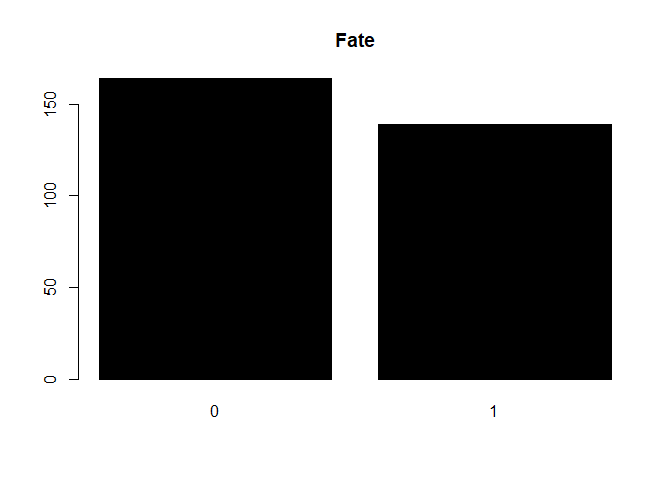<!-- -->
\`\`

``` r
summary(heart.data)
```

    ##       age             sex               cp           trestbps    
    ##  Min.   :29.00   Min.   :0.0000   Min.   :1.000   Min.   : 94.0  
    ##  1st Qu.:48.00   1st Qu.:0.0000   1st Qu.:3.000   1st Qu.:120.0  
    ##  Median :56.00   Median :1.0000   Median :3.000   Median :130.0  
    ##  Mean   :54.44   Mean   :0.6799   Mean   :3.158   Mean   :131.7  
    ##  3rd Qu.:61.00   3rd Qu.:1.0000   3rd Qu.:4.000   3rd Qu.:140.0  
    ##  Max.   :77.00   Max.   :1.0000   Max.   :4.000   Max.   :200.0  
    ##                                                                  
    ##       chol            fbs            restecg          thalach     
    ##  Min.   :126.0   Min.   :0.0000   Min.   :0.0000   Min.   : 71.0  
    ##  1st Qu.:211.0   1st Qu.:0.0000   1st Qu.:0.0000   1st Qu.:133.5  
    ##  Median :241.0   Median :0.0000   Median :1.0000   Median :153.0  
    ##  Mean   :246.7   Mean   :0.1485   Mean   :0.9901   Mean   :149.6  
    ##  3rd Qu.:275.0   3rd Qu.:0.0000   3rd Qu.:2.0000   3rd Qu.:166.0  
    ##  Max.   :564.0   Max.   :1.0000   Max.   :2.0000   Max.   :202.0  
    ##                                                                   
    ##      exang           oldpeak         slope             ca        
    ##  Min.   :0.0000   Min.   :0.00   Min.   :1.000   Min.   :0.0000  
    ##  1st Qu.:0.0000   1st Qu.:0.00   1st Qu.:1.000   1st Qu.:0.0000  
    ##  Median :0.0000   Median :0.80   Median :2.000   Median :0.0000  
    ##  Mean   :0.3267   Mean   :1.04   Mean   :1.601   Mean   :0.6722  
    ##  3rd Qu.:1.0000   3rd Qu.:1.60   3rd Qu.:2.000   3rd Qu.:1.0000  
    ##  Max.   :1.0000   Max.   :6.20   Max.   :3.000   Max.   :3.0000  
    ##                                                  NA's   :4       
    ##       thal            num        
    ##  Min.   :3.000   Min.   :0.0000  
    ##  1st Qu.:3.000   1st Qu.:0.0000  
    ##  Median :3.000   Median :0.0000  
    ##  Mean   :4.734   Mean   :0.4587  
    ##  3rd Qu.:7.000   3rd Qu.:1.0000  
    ##  Max.   :7.000   Max.   :1.0000  
    ##  NA's   :2

``` r
glm.fit2 = glm(num ~ cp + ca +exang+ sex + thalach+oldpeak , data = heart.data , family = binomial)
glm.fit3 = glm(num ~ cp + ca +sex + thalach+thal+oldpeak + thalach*age, data = heart.data , family = binomial)
glm.fit4 = glm(num ~ cp + ca +sex + thalach+thal+oldpeak + thalach*cp, data = heart.data , family = binomial)
glm.fit5 = glm(num ~ cp + ca +sex + thalach+thal+oldpeak + thalach*exang, data = heart.data , family = binomial)
glm.fit6 = glm(num ~ cp + ca +sex + thalach+thal+oldpeak + thalach*oldpeak, data = heart.data , family = binomial)
glm.fit7 = glm(num ~ cp + ca +sex + thalach+thal+oldpeak + thalach*slope, data = heart.data , family = binomial)
glm.fit8 = glm(num ~ cp + ca +sex + thalach+thal+oldpeak + slope*oldpeak, data = heart.data , family = binomial)
glm.fit9 = glm(num ~ cp + ca +sex + thalach+thal+oldpeak + exang*cp, data = heart.data , family = binomial)


#vif(glm(num ~ cp + ca +exang+ sex + thalach+oldpeak , data = heart.data , family = binomial))
summary(glm.fit3)
```

    ## 
    ## Call:
    ## glm(formula = num ~ cp + ca + sex + thalach + thal + oldpeak + 
    ##     thalach * age, family = binomial, data = heart.data)
    ## 
    ## Deviance Residuals: 
    ##     Min       1Q   Median       3Q      Max  
    ## -2.7803  -0.5546  -0.2236   0.4557   2.3667  
    ## 
    ## Coefficients:
    ##               Estimate Std. Error z value Pr(>|z|)    
    ## (Intercept) 11.2118552  8.2534914   1.358 0.174325    
    ## cp           0.6163113  0.1813787   3.398 0.000679 ***
    ## ca           0.9998272  0.2322969   4.304 1.68e-05 ***
    ## sex          0.9430485  0.4183543   2.254 0.024184 *  
    ## thalach     -0.1125884  0.0530691  -2.122 0.033876 *  
    ## thal         0.3768663  0.0943097   3.996 6.44e-05 ***
    ## oldpeak      0.5512489  0.1755181   3.141 0.001685 ** 
    ## age         -0.2436191  0.1414134  -1.723 0.084935 .  
    ## thalach:age  0.0016298  0.0009299   1.753 0.079682 .  
    ## ---
    ## Signif. codes:  0 '***' 0.001 '**' 0.01 '*' 0.05 '.' 0.1 ' ' 1
    ## 
    ## (Dispersion parameter for binomial family taken to be 1)
    ## 
    ##     Null deviance: 409.95  on 296  degrees of freedom
    ## Residual deviance: 221.04  on 288  degrees of freedom
    ##   (6 observations deleted due to missingness)
    ## AIC: 239.04
    ## 
    ## Number of Fisher Scoring iterations: 5

``` r
anova(glm.fit3, test = "Chisq")
```

    ## Analysis of Deviance Table
    ## 
    ## Model: binomial, link: logit
    ## 
    ## Response: num
    ## 
    ## Terms added sequentially (first to last)
    ## 
    ## 
    ##             Df Deviance Resid. Df Resid. Dev  Pr(>Chi)    
    ## NULL                          296     409.95              
    ## cp           1   55.019       295     354.93 1.193e-13 ***
    ## ca           1   52.704       294     302.22 3.878e-13 ***
    ## sex          1   22.373       293     279.85 2.245e-06 ***
    ## thalach      1   21.278       292     258.57 3.972e-06 ***
    ## thal         1   23.706       291     234.87 1.122e-06 ***
    ## oldpeak      1   10.549       290     224.32  0.001162 ** 
    ## age          1    0.004       289     224.31  0.947618    
    ## thalach:age  1    3.273       288     221.04  0.070426 .  
    ## ---
    ## Signif. codes:  0 '***' 0.001 '**' 0.01 '*' 0.05 '.' 0.1 ' ' 1

``` r
summary(glm.fit4)
```

    ## 
    ## Call:
    ## glm(formula = num ~ cp + ca + sex + thalach + thal + oldpeak + 
    ##     thalach * cp, family = binomial, data = heart.data)
    ## 
    ## Deviance Residuals: 
    ##     Min       1Q   Median       3Q      Max  
    ## -2.7906  -0.5645  -0.2782   0.4561   2.3910  
    ## 
    ## Coefficients:
    ##              Estimate Std. Error z value Pr(>|z|)    
    ## (Intercept) -3.676477   4.484439  -0.820  0.41231    
    ## cp           0.987364   1.311221   0.753  0.45144    
    ## ca           1.037821   0.223020   4.653 3.26e-06 ***
    ## sex          0.873014   0.406510   2.148  0.03175 *  
    ## thalach     -0.014337   0.028766  -0.498  0.61821    
    ## thal         0.398120   0.093194   4.272 1.94e-05 ***
    ## oldpeak      0.532629   0.171416   3.107  0.00189 ** 
    ## cp:thalach  -0.002400   0.008516  -0.282  0.77804    
    ## ---
    ## Signif. codes:  0 '***' 0.001 '**' 0.01 '*' 0.05 '.' 0.1 ' ' 1
    ## 
    ## (Dispersion parameter for binomial family taken to be 1)
    ## 
    ##     Null deviance: 409.95  on 296  degrees of freedom
    ## Residual deviance: 224.24  on 289  degrees of freedom
    ##   (6 observations deleted due to missingness)
    ## AIC: 240.24
    ## 
    ## Number of Fisher Scoring iterations: 5

``` r
anova(glm.fit4, test = "Chisq")
```

    ## Analysis of Deviance Table
    ## 
    ## Model: binomial, link: logit
    ## 
    ## Response: num
    ## 
    ## Terms added sequentially (first to last)
    ## 
    ## 
    ##            Df Deviance Resid. Df Resid. Dev  Pr(>Chi)    
    ## NULL                         296     409.95              
    ## cp          1   55.019       295     354.93 1.193e-13 ***
    ## ca          1   52.704       294     302.22 3.878e-13 ***
    ## sex         1   22.373       293     279.85 2.245e-06 ***
    ## thalach     1   21.278       292     258.57 3.972e-06 ***
    ## thal        1   23.706       291     234.87 1.122e-06 ***
    ## oldpeak     1   10.549       290     224.32  0.001162 ** 
    ## cp:thalach  1    0.080       289     224.24  0.777830    
    ## ---
    ## Signif. codes:  0 '***' 0.001 '**' 0.01 '*' 0.05 '.' 0.1 ' ' 1

``` r
summary(glm.fit5)
```

    ## 
    ## Call:
    ## glm(formula = num ~ cp + ca + sex + thalach + thal + oldpeak + 
    ##     thalach * exang, family = binomial, data = heart.data)
    ## 
    ## Deviance Residuals: 
    ##     Min       1Q   Median       3Q      Max  
    ## -2.6504  -0.5837  -0.2710   0.4427   2.3914  
    ## 
    ## Coefficients:
    ##                Estimate Std. Error z value Pr(>|z|)    
    ## (Intercept)   -3.091462   1.796024  -1.721  0.08520 .  
    ## cp             0.518310   0.182450   2.841  0.00450 ** 
    ## ca             1.037072   0.223297   4.644 3.41e-06 ***
    ## sex            0.859831   0.419034   2.052  0.04018 *  
    ## thalach       -0.016684   0.010200  -1.636  0.10190    
    ## thal           0.373480   0.095472   3.912 9.16e-05 ***
    ## oldpeak        0.482863   0.175418   2.753  0.00591 ** 
    ## exang          1.719223   2.771223   0.620  0.53500    
    ## thalach:exang -0.005361   0.018697  -0.287  0.77430    
    ## ---
    ## Signif. codes:  0 '***' 0.001 '**' 0.01 '*' 0.05 '.' 0.1 ' ' 1
    ## 
    ## (Dispersion parameter for binomial family taken to be 1)
    ## 
    ##     Null deviance: 409.95  on 296  degrees of freedom
    ## Residual deviance: 218.77  on 288  degrees of freedom
    ##   (6 observations deleted due to missingness)
    ## AIC: 236.77
    ## 
    ## Number of Fisher Scoring iterations: 5

``` r
anova(glm.fit5, test = "Chisq")
```

    ## Analysis of Deviance Table
    ## 
    ## Model: binomial, link: logit
    ## 
    ## Response: num
    ## 
    ## Terms added sequentially (first to last)
    ## 
    ## 
    ##               Df Deviance Resid. Df Resid. Dev  Pr(>Chi)    
    ## NULL                            296     409.95              
    ## cp             1   55.019       295     354.93 1.193e-13 ***
    ## ca             1   52.704       294     302.22 3.878e-13 ***
    ## sex            1   22.373       293     279.85 2.245e-06 ***
    ## thalach        1   21.278       292     258.57 3.972e-06 ***
    ## thal           1   23.706       291     234.87 1.122e-06 ***
    ## oldpeak        1   10.549       290     224.32  0.001162 ** 
    ## exang          1    5.465       289     218.85  0.019399 *  
    ## thalach:exang  1    0.083       288     218.77  0.773373    
    ## ---
    ## Signif. codes:  0 '***' 0.001 '**' 0.01 '*' 0.05 '.' 0.1 ' ' 1

``` r
summary(glm.fit6)
```

    ## 
    ## Call:
    ## glm(formula = num ~ cp + ca + sex + thalach + thal + oldpeak + 
    ##     thalach * oldpeak, family = binomial, data = heart.data)
    ## 
    ## Deviance Residuals: 
    ##     Min       1Q   Median       3Q      Max  
    ## -2.7923  -0.5608  -0.2891   0.4632   2.3717  
    ## 
    ## Coefficients:
    ##                  Estimate Std. Error z value Pr(>|z|)    
    ## (Intercept)     -3.272649   1.992978  -1.642 0.100571    
    ## cp               0.610058   0.178805   3.412 0.000645 ***
    ## ca               1.029706   0.223240   4.613 3.98e-06 ***
    ## sex              0.872051   0.406097   2.147 0.031762 *  
    ## thalach         -0.016822   0.011654  -1.444 0.148879    
    ## thal             0.399760   0.093211   4.289 1.80e-05 ***
    ## oldpeak          1.361542   1.298481   1.049 0.294378    
    ## thalach:oldpeak -0.005456   0.008505  -0.642 0.521186    
    ## ---
    ## Signif. codes:  0 '***' 0.001 '**' 0.01 '*' 0.05 '.' 0.1 ' ' 1
    ## 
    ## (Dispersion parameter for binomial family taken to be 1)
    ## 
    ##     Null deviance: 409.95  on 296  degrees of freedom
    ## Residual deviance: 223.89  on 289  degrees of freedom
    ##   (6 observations deleted due to missingness)
    ## AIC: 239.89
    ## 
    ## Number of Fisher Scoring iterations: 5

``` r
anova(glm.fit6, test = "Chisq")
```

    ## Analysis of Deviance Table
    ## 
    ## Model: binomial, link: logit
    ## 
    ## Response: num
    ## 
    ## Terms added sequentially (first to last)
    ## 
    ## 
    ##                 Df Deviance Resid. Df Resid. Dev  Pr(>Chi)    
    ## NULL                              296     409.95              
    ## cp               1   55.019       295     354.93 1.193e-13 ***
    ## ca               1   52.704       294     302.22 3.878e-13 ***
    ## sex              1   22.373       293     279.85 2.245e-06 ***
    ## thalach          1   21.278       292     258.57 3.972e-06 ***
    ## thal             1   23.706       291     234.87 1.122e-06 ***
    ## oldpeak          1   10.549       290     224.32  0.001162 ** 
    ## thalach:oldpeak  1    0.424       289     223.89  0.515170    
    ## ---
    ## Signif. codes:  0 '***' 0.001 '**' 0.01 '*' 0.05 '.' 0.1 ' ' 1

``` r
summary(glm.fit7)
```

    ## 
    ## Call:
    ## glm(formula = num ~ cp + ca + sex + thalach + thal + oldpeak + 
    ##     thalach * slope, family = binomial, data = heart.data)
    ## 
    ## Deviance Residuals: 
    ##     Min       1Q   Median       3Q      Max  
    ## -2.8478  -0.5674  -0.2645   0.4723   2.4762  
    ## 
    ## Coefficients:
    ##                Estimate Std. Error z value Pr(>|z|)    
    ## (Intercept)   -6.100827   4.153703  -1.469  0.14190    
    ## cp             0.631004   0.179829   3.509  0.00045 ***
    ## ca             1.078705   0.229526   4.700 2.61e-06 ***
    ## sex            0.905491   0.412802   2.194  0.02827 *  
    ## thalach       -0.003008   0.025355  -0.119  0.90556    
    ## thal           0.391952   0.094386   4.153 3.29e-05 ***
    ## oldpeak        0.398131   0.197939   2.011  0.04428 *  
    ## slope          1.967262   2.171302   0.906  0.36492    
    ## thalach:slope -0.009767   0.013816  -0.707  0.47962    
    ## ---
    ## Signif. codes:  0 '***' 0.001 '**' 0.01 '*' 0.05 '.' 0.1 ' ' 1
    ## 
    ## (Dispersion parameter for binomial family taken to be 1)
    ## 
    ##     Null deviance: 409.95  on 296  degrees of freedom
    ## Residual deviance: 221.96  on 288  degrees of freedom
    ##   (6 observations deleted due to missingness)
    ## AIC: 239.96
    ## 
    ## Number of Fisher Scoring iterations: 5

``` r
anova(glm.fit7, test = "Chisq")
```

    ## Analysis of Deviance Table
    ## 
    ## Model: binomial, link: logit
    ## 
    ## Response: num
    ## 
    ## Terms added sequentially (first to last)
    ## 
    ## 
    ##               Df Deviance Resid. Df Resid. Dev  Pr(>Chi)    
    ## NULL                            296     409.95              
    ## cp             1   55.019       295     354.93 1.193e-13 ***
    ## ca             1   52.704       294     302.22 3.878e-13 ***
    ## sex            1   22.373       293     279.85 2.245e-06 ***
    ## thalach        1   21.278       292     258.57 3.972e-06 ***
    ## thal           1   23.706       291     234.87 1.122e-06 ***
    ## oldpeak        1   10.549       290     224.32  0.001162 ** 
    ## slope          1    1.845       289     222.47  0.174346    
    ## thalach:slope  1    0.509       288     221.96  0.475462    
    ## ---
    ## Signif. codes:  0 '***' 0.001 '**' 0.01 '*' 0.05 '.' 0.1 ' ' 1

``` r
summary(glm.fit8)
```

    ## 
    ## Call:
    ## glm(formula = num ~ cp + ca + sex + thalach + thal + oldpeak + 
    ##     slope * oldpeak, family = binomial, data = heart.data)
    ## 
    ## Deviance Residuals: 
    ##     Min       1Q   Median       3Q      Max  
    ## -2.8474  -0.5579  -0.2577   0.4709   2.3684  
    ## 
    ## Coefficients:
    ##                Estimate Std. Error z value Pr(>|z|)    
    ## (Intercept)   -3.311554   1.843015  -1.797 0.072365 .  
    ## cp             0.635617   0.180247   3.526 0.000421 ***
    ## ca             1.085625   0.230185   4.716 2.40e-06 ***
    ## sex            0.908904   0.411248   2.210 0.027097 *  
    ## thalach       -0.020212   0.008699  -2.323 0.020155 *  
    ## thal           0.388707   0.093948   4.137 3.51e-05 ***
    ## oldpeak        0.273667   0.546595   0.501 0.616600    
    ## slope          0.385090   0.424808   0.907 0.364669    
    ## oldpeak:slope  0.067321   0.270622   0.249 0.803543    
    ## ---
    ## Signif. codes:  0 '***' 0.001 '**' 0.01 '*' 0.05 '.' 0.1 ' ' 1
    ## 
    ## (Dispersion parameter for binomial family taken to be 1)
    ## 
    ##     Null deviance: 409.95  on 296  degrees of freedom
    ## Residual deviance: 222.41  on 288  degrees of freedom
    ##   (6 observations deleted due to missingness)
    ## AIC: 240.41
    ## 
    ## Number of Fisher Scoring iterations: 5

``` r
anova(glm.fit8, test = "Chisq")
```

    ## Analysis of Deviance Table
    ## 
    ## Model: binomial, link: logit
    ## 
    ## Response: num
    ## 
    ## Terms added sequentially (first to last)
    ## 
    ## 
    ##               Df Deviance Resid. Df Resid. Dev  Pr(>Chi)    
    ## NULL                            296     409.95              
    ## cp             1   55.019       295     354.93 1.193e-13 ***
    ## ca             1   52.704       294     302.22 3.878e-13 ***
    ## sex            1   22.373       293     279.85 2.245e-06 ***
    ## thalach        1   21.278       292     258.57 3.972e-06 ***
    ## thal           1   23.706       291     234.87 1.122e-06 ***
    ## oldpeak        1   10.549       290     224.32  0.001162 ** 
    ## slope          1    1.845       289     222.47  0.174346    
    ## oldpeak:slope  1    0.063       288     222.41  0.802468    
    ## ---
    ## Signif. codes:  0 '***' 0.001 '**' 0.01 '*' 0.05 '.' 0.1 ' ' 1

``` r
summary(glm.fit9)
```

    ## 
    ## Call:
    ## glm(formula = num ~ cp + ca + sex + thalach + thal + oldpeak + 
    ##     exang * cp, family = binomial, data = heart.data)
    ## 
    ## Deviance Residuals: 
    ##     Min       1Q   Median       3Q      Max  
    ## -2.6568  -0.5275  -0.2634   0.4147   2.4791  
    ## 
    ## Coefficients:
    ##              Estimate Std. Error z value Pr(>|z|)    
    ## (Intercept) -2.390533   1.652805  -1.446 0.148079    
    ## cp           0.301203   0.203126   1.483 0.138116    
    ## ca           1.041732   0.221191   4.710 2.48e-06 ***
    ## sex          0.949708   0.427194   2.223 0.026207 *  
    ## thalach     -0.017343   0.008803  -1.970 0.048833 *  
    ## thal         0.363691   0.096911   3.753 0.000175 ***
    ## oldpeak      0.498794   0.179250   2.783 0.005391 ** 
    ## exang       -2.422501   1.744724  -1.388 0.164993    
    ## cp:exang     0.996821   0.489944   2.035 0.041895 *  
    ## ---
    ## Signif. codes:  0 '***' 0.001 '**' 0.01 '*' 0.05 '.' 0.1 ' ' 1
    ## 
    ## (Dispersion parameter for binomial family taken to be 1)
    ## 
    ##     Null deviance: 409.95  on 296  degrees of freedom
    ## Residual deviance: 213.80  on 288  degrees of freedom
    ##   (6 observations deleted due to missingness)
    ## AIC: 231.8
    ## 
    ## Number of Fisher Scoring iterations: 5

``` r
anova(glm.fit9, test = "Chisq")
```

    ## Analysis of Deviance Table
    ## 
    ## Model: binomial, link: logit
    ## 
    ## Response: num
    ## 
    ## Terms added sequentially (first to last)
    ## 
    ## 
    ##          Df Deviance Resid. Df Resid. Dev  Pr(>Chi)    
    ## NULL                       296     409.95              
    ## cp        1   55.019       295     354.93 1.193e-13 ***
    ## ca        1   52.704       294     302.22 3.878e-13 ***
    ## sex       1   22.373       293     279.85 2.245e-06 ***
    ## thalach   1   21.278       292     258.57 3.972e-06 ***
    ## thal      1   23.706       291     234.87 1.122e-06 ***
    ## oldpeak   1   10.549       290     224.32  0.001162 ** 
    ## exang     1    5.465       289     218.85  0.019399 *  
    ## cp:exang  1    5.054       288     213.80  0.024570 *  
    ## ---
    ## Signif. codes:  0 '***' 0.001 '**' 0.01 '*' 0.05 '.' 0.1 ' ' 1

``` r
#null.glm<-glm(num~1,family=binomial, data=heart.data)
 anova(glm.fit3,glm.fit4,glm.fit5,glm.fit6,glm.fit7,glm.fit8,glm.fit9,test="Chisq")
```

    ## Analysis of Deviance Table
    ## 
    ## Model 1: num ~ cp + ca + sex + thalach + thal + oldpeak + thalach * age
    ## Model 2: num ~ cp + ca + sex + thalach + thal + oldpeak + thalach * cp
    ## Model 3: num ~ cp + ca + sex + thalach + thal + oldpeak + thalach * exang
    ## Model 4: num ~ cp + ca + sex + thalach + thal + oldpeak + thalach * oldpeak
    ## Model 5: num ~ cp + ca + sex + thalach + thal + oldpeak + thalach * slope
    ## Model 6: num ~ cp + ca + sex + thalach + thal + oldpeak + slope * oldpeak
    ## Model 7: num ~ cp + ca + sex + thalach + thal + oldpeak + exang * cp
    ##   Resid. Df Resid. Dev Df Deviance Pr(>Chi)  
    ## 1       288     221.04                       
    ## 2       289     224.24 -1  -3.1978  0.07374 .
    ## 3       288     218.77  1   5.4685  0.01936 *
    ## 4       289     223.89 -1  -5.1245  0.02359 *
    ## 5       288     221.96  1   1.9309  0.16466  
    ## 6       288     222.41  0  -0.4467           
    ## 7       288     213.80  0   8.6114           
    ## ---
    ## Signif. codes:  0 '***' 0.001 '**' 0.01 '*' 0.05 '.' 0.1 ' ' 1

Final model I chose , based on the
relationships

``` r
heart.fit = glm(num ~ ca +sex + thalach+thal+oldpeak + exang*cp, data = heart.data , family = binomial)


mdl1 = glm(num ~ ca + sex + thalach + thal + oldpeak + exang * cp ,data = heart.data , family = binomial)
mdl2 = glm(num ~ ca + sex + thalach + thal + oldpeak + thalach * cp,data = heart.data , family = binomial)
mdl3 = glm(num ~ cp + ca + sex  + thal + oldpeak + thalach * exang,data = heart.data , family = binomial)
summary(mdl1)
```

    ## 
    ## Call:
    ## glm(formula = num ~ ca + sex + thalach + thal + oldpeak + exang * 
    ##     cp, family = binomial, data = heart.data)
    ## 
    ## Deviance Residuals: 
    ##     Min       1Q   Median       3Q      Max  
    ## -2.6568  -0.5275  -0.2634   0.4147   2.4791  
    ## 
    ## Coefficients:
    ##              Estimate Std. Error z value Pr(>|z|)    
    ## (Intercept) -2.390533   1.652805  -1.446 0.148079    
    ## ca           1.041732   0.221191   4.710 2.48e-06 ***
    ## sex          0.949708   0.427194   2.223 0.026207 *  
    ## thalach     -0.017343   0.008803  -1.970 0.048833 *  
    ## thal         0.363691   0.096911   3.753 0.000175 ***
    ## oldpeak      0.498794   0.179250   2.783 0.005391 ** 
    ## exang       -2.422501   1.744724  -1.388 0.164993    
    ## cp           0.301203   0.203126   1.483 0.138116    
    ## exang:cp     0.996821   0.489944   2.035 0.041895 *  
    ## ---
    ## Signif. codes:  0 '***' 0.001 '**' 0.01 '*' 0.05 '.' 0.1 ' ' 1
    ## 
    ## (Dispersion parameter for binomial family taken to be 1)
    ## 
    ##     Null deviance: 409.95  on 296  degrees of freedom
    ## Residual deviance: 213.80  on 288  degrees of freedom
    ##   (6 observations deleted due to missingness)
    ## AIC: 231.8
    ## 
    ## Number of Fisher Scoring iterations: 5

``` r
summary(mdl2)
```

    ## 
    ## Call:
    ## glm(formula = num ~ ca + sex + thalach + thal + oldpeak + thalach * 
    ##     cp, family = binomial, data = heart.data)
    ## 
    ## Deviance Residuals: 
    ##     Min       1Q   Median       3Q      Max  
    ## -2.7906  -0.5645  -0.2782   0.4561   2.3910  
    ## 
    ## Coefficients:
    ##              Estimate Std. Error z value Pr(>|z|)    
    ## (Intercept) -3.676477   4.484439  -0.820  0.41231    
    ## ca           1.037821   0.223020   4.653 3.26e-06 ***
    ## sex          0.873014   0.406510   2.148  0.03175 *  
    ## thalach     -0.014337   0.028766  -0.498  0.61821    
    ## thal         0.398120   0.093194   4.272 1.94e-05 ***
    ## oldpeak      0.532629   0.171416   3.107  0.00189 ** 
    ## cp           0.987364   1.311221   0.753  0.45144    
    ## thalach:cp  -0.002400   0.008516  -0.282  0.77804    
    ## ---
    ## Signif. codes:  0 '***' 0.001 '**' 0.01 '*' 0.05 '.' 0.1 ' ' 1
    ## 
    ## (Dispersion parameter for binomial family taken to be 1)
    ## 
    ##     Null deviance: 409.95  on 296  degrees of freedom
    ## Residual deviance: 224.24  on 289  degrees of freedom
    ##   (6 observations deleted due to missingness)
    ## AIC: 240.24
    ## 
    ## Number of Fisher Scoring iterations: 5

``` r
summary(mdl3)
```

    ## 
    ## Call:
    ## glm(formula = num ~ cp + ca + sex + thal + oldpeak + thalach * 
    ##     exang, family = binomial, data = heart.data)
    ## 
    ## Deviance Residuals: 
    ##     Min       1Q   Median       3Q      Max  
    ## -2.6504  -0.5837  -0.2710   0.4427   2.3914  
    ## 
    ## Coefficients:
    ##                Estimate Std. Error z value Pr(>|z|)    
    ## (Intercept)   -3.091462   1.796024  -1.721  0.08520 .  
    ## cp             0.518310   0.182450   2.841  0.00450 ** 
    ## ca             1.037072   0.223297   4.644 3.41e-06 ***
    ## sex            0.859831   0.419034   2.052  0.04018 *  
    ## thal           0.373480   0.095472   3.912 9.16e-05 ***
    ## oldpeak        0.482863   0.175418   2.753  0.00591 ** 
    ## thalach       -0.016684   0.010200  -1.636  0.10190    
    ## exang          1.719223   2.771223   0.620  0.53500    
    ## thalach:exang -0.005361   0.018697  -0.287  0.77430    
    ## ---
    ## Signif. codes:  0 '***' 0.001 '**' 0.01 '*' 0.05 '.' 0.1 ' ' 1
    ## 
    ## (Dispersion parameter for binomial family taken to be 1)
    ## 
    ##     Null deviance: 409.95  on 296  degrees of freedom
    ## Residual deviance: 218.77  on 288  degrees of freedom
    ##   (6 observations deleted due to missingness)
    ## AIC: 236.77
    ## 
    ## Number of Fisher Scoring iterations: 5

``` r
anova(mdl1,mdl2,mdl3,test="Chisq")
```

    ## Analysis of Deviance Table
    ## 
    ## Model 1: num ~ ca + sex + thalach + thal + oldpeak + exang * cp
    ## Model 2: num ~ ca + sex + thalach + thal + oldpeak + thalach * cp
    ## Model 3: num ~ cp + ca + sex + thal + oldpeak + thalach * exang
    ##   Resid. Df Resid. Dev Df Deviance Pr(>Chi)   
    ## 1       288     213.80                        
    ## 2       289     224.24 -1 -10.4395 0.001233 **
    ## 3       288     218.77  1   5.4685 0.019362 * 
    ## ---
    ## Signif. codes:  0 '***' 0.001 '**' 0.01 '*' 0.05 '.' 0.1 ' ' 1

``` r
plot(glm.fit2,which=1:6)
```

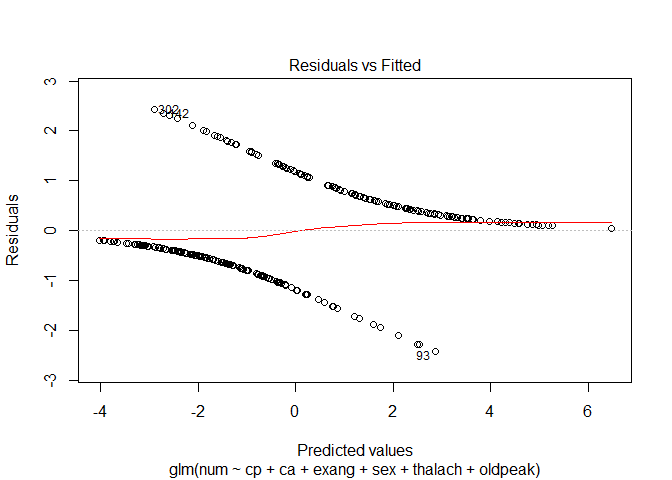<!-- -->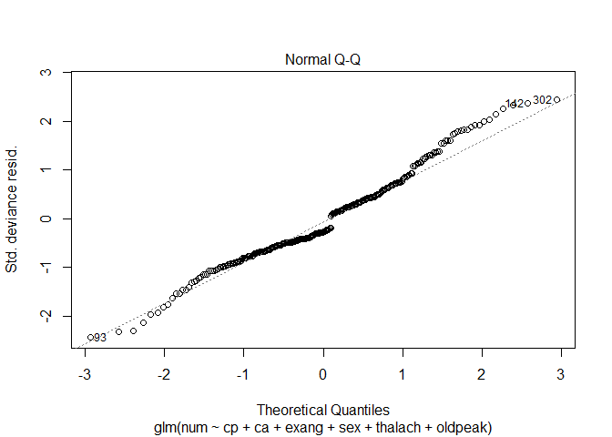<!-- -->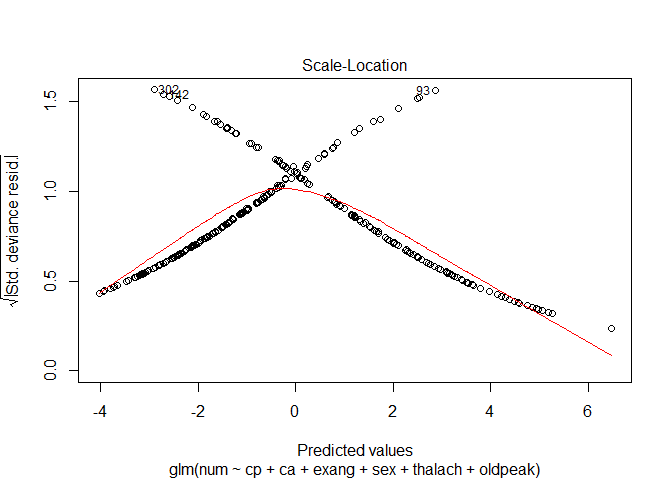<!-- -->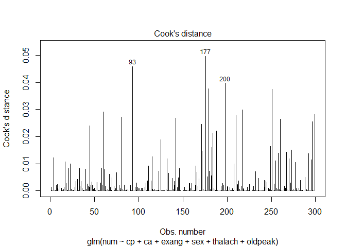<!-- -->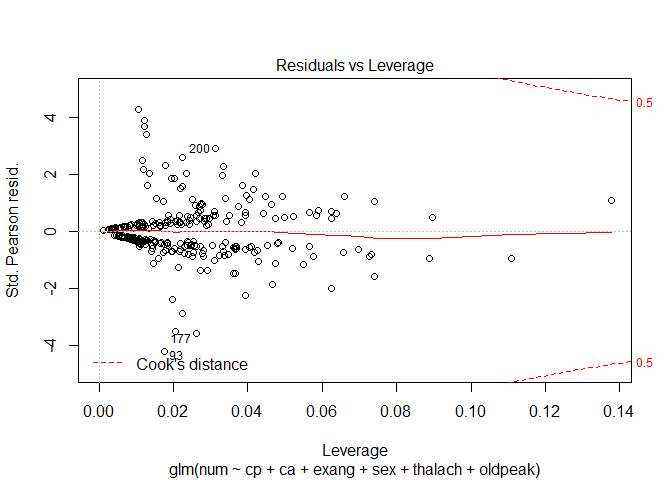<!-- -->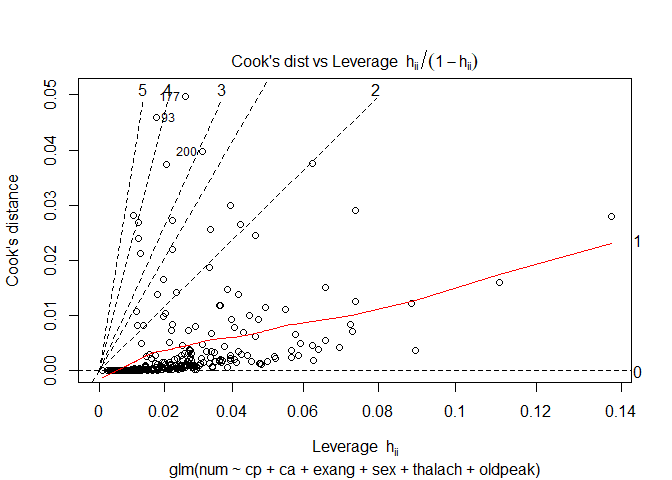<!-- -->

``` r
plot(mdl1,which=1)
```

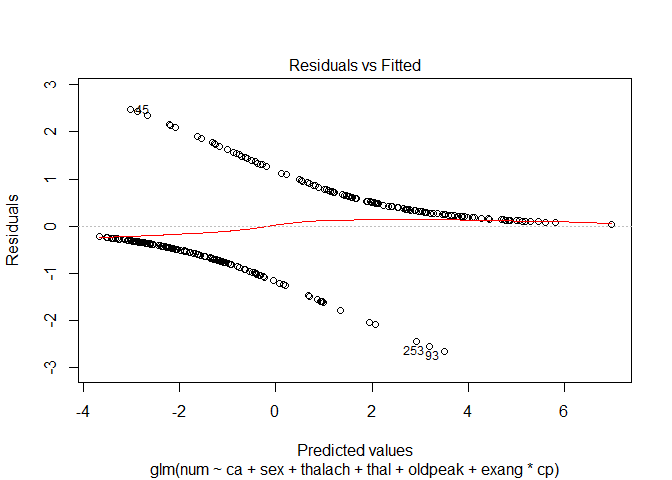<!-- -->

``` r
mdl1 = glm(num ~ ca + sex + thalach + thal + oldpeak + exang * cp ,data = heart.data[-c(200,299,177,93),] , family = binomial)
mdl2 = glm(num ~ ca + sex + thalach + thal + oldpeak + thalach * cp,data = heart.data[-c(200,299,177,93),] , family = binomial)
mdl3 = glm(num ~ cp + ca + sex  + thal + oldpeak + thalach * exang,data = heart.data[-c(200, 299,177,93),] , family = binomial)
summary(mdl1)
```

    ## 
    ## Call:
    ## glm(formula = num ~ ca + sex + thalach + thal + oldpeak + exang * 
    ##     cp, family = binomial, data = heart.data[-c(200, 299, 177, 
    ##     93), ])
    ## 
    ## Deviance Residuals: 
    ##     Min       1Q   Median       3Q      Max  
    ## -2.5852  -0.4884  -0.2344   0.3305   2.4830  
    ## 
    ## Coefficients:
    ##              Estimate Std. Error z value Pr(>|z|)    
    ## (Intercept) -4.174805   1.851749  -2.255  0.02416 *  
    ## ca           1.388832   0.260170   5.338 9.39e-08 ***
    ## sex          0.918556   0.452039   2.032  0.04215 *  
    ## thalach     -0.012720   0.009478  -1.342  0.17961    
    ## thal         0.420542   0.103845   4.050 5.13e-05 ***
    ## oldpeak      0.556104   0.192454   2.890  0.00386 ** 
    ## exang       -1.945598   1.818683  -1.070  0.28472    
    ## cp           0.506754   0.224838   2.254  0.02420 *  
    ## exang:cp     0.843018   0.511155   1.649  0.09910 .  
    ## ---
    ## Signif. codes:  0 '***' 0.001 '**' 0.01 '*' 0.05 '.' 0.1 ' ' 1
    ## 
    ## (Dispersion parameter for binomial family taken to be 1)
    ## 
    ##     Null deviance: 404.38  on 292  degrees of freedom
    ## Residual deviance: 191.49  on 284  degrees of freedom
    ##   (6 observations deleted due to missingness)
    ## AIC: 209.49
    ## 
    ## Number of Fisher Scoring iterations: 6

``` r
summary(mdl2)
```

    ## 
    ## Call:
    ## glm(formula = num ~ ca + sex + thalach + thal + oldpeak + thalach * 
    ##     cp, family = binomial, data = heart.data[-c(200, 299, 177, 
    ##     93), ])
    ## 
    ## Deviance Residuals: 
    ##     Min       1Q   Median       3Q      Max  
    ## -2.4778  -0.4956  -0.2486   0.3755   2.3743  
    ## 
    ## Coefficients:
    ##              Estimate Std. Error z value Pr(>|z|)    
    ## (Intercept) -9.672330   5.189034  -1.864  0.06232 .  
    ## ca           1.411655   0.261926   5.390 7.06e-08 ***
    ## sex          0.836917   0.436569   1.917  0.05523 .  
    ## thalach      0.017601   0.032291   0.545  0.58571    
    ## thal         0.451744   0.100847   4.479 7.48e-06 ***
    ## oldpeak      0.588785   0.185543   3.173  0.00151 ** 
    ## cp           2.450244   1.489851   1.645  0.10005    
    ## thalach:cp  -0.010674   0.009466  -1.128  0.25948    
    ## ---
    ## Signif. codes:  0 '***' 0.001 '**' 0.01 '*' 0.05 '.' 0.1 ' ' 1
    ## 
    ## (Dispersion parameter for binomial family taken to be 1)
    ## 
    ##     Null deviance: 404.38  on 292  degrees of freedom
    ## Residual deviance: 197.78  on 285  degrees of freedom
    ##   (6 observations deleted due to missingness)
    ## AIC: 213.78
    ## 
    ## Number of Fisher Scoring iterations: 6

``` r
summary(mdl3)
```

    ## 
    ## Call:
    ## glm(formula = num ~ cp + ca + sex + thal + oldpeak + thalach * 
    ##     exang, family = binomial, data = heart.data[-c(200, 299, 
    ##     177, 93), ])
    ## 
    ## Deviance Residuals: 
    ##     Min       1Q   Median       3Q      Max  
    ## -2.5457  -0.5391  -0.2374   0.3505   2.4022  
    ## 
    ## Coefficients:
    ##                Estimate Std. Error z value Pr(>|z|)    
    ## (Intercept)   -4.902032   1.996296  -2.456 0.014066 *  
    ## cp             0.699827   0.200877   3.484 0.000494 ***
    ## ca             1.401017   0.264255   5.302 1.15e-07 ***
    ## sex            0.835401   0.445368   1.876 0.060689 .  
    ## thal           0.428539   0.102704   4.173 3.01e-05 ***
    ## oldpeak        0.548193   0.189787   2.888 0.003871 ** 
    ## thalach       -0.011564   0.010983  -1.053 0.292387    
    ## exang          1.873577   2.925092   0.641 0.521835    
    ## thalach:exang -0.006687   0.019754  -0.339 0.734985    
    ## ---
    ## Signif. codes:  0 '***' 0.001 '**' 0.01 '*' 0.05 '.' 0.1 ' ' 1
    ## 
    ## (Dispersion parameter for binomial family taken to be 1)
    ## 
    ##     Null deviance: 404.38  on 292  degrees of freedom
    ## Residual deviance: 194.58  on 284  degrees of freedom
    ##   (6 observations deleted due to missingness)
    ## AIC: 212.58
    ## 
    ## Number of Fisher Scoring iterations: 6

``` r
anova(mdl1,mdl2,mdl3,test="Chisq")
```

    ## Analysis of Deviance Table
    ## 
    ## Model 1: num ~ ca + sex + thalach + thal + oldpeak + exang * cp
    ## Model 2: num ~ ca + sex + thalach + thal + oldpeak + thalach * cp
    ## Model 3: num ~ cp + ca + sex + thal + oldpeak + thalach * exang
    ##   Resid. Df Resid. Dev Df Deviance Pr(>Chi)  
    ## 1       284     191.49                       
    ## 2       285     197.78 -1  -6.2916  0.01213 *
    ## 3       284     194.58  1   3.2017  0.07356 .
    ## ---
    ## Signif. codes:  0 '***' 0.001 '**' 0.01 '*' 0.05 '.' 0.1 ' ' 1

``` r
plot(mdl2,which=1:6)
```

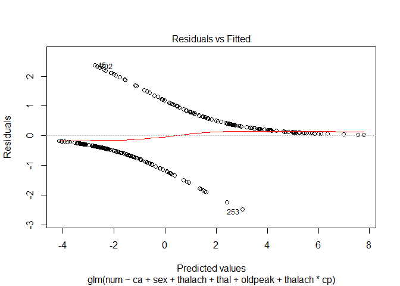<!-- -->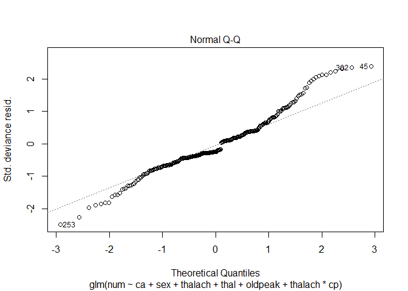<!-- -->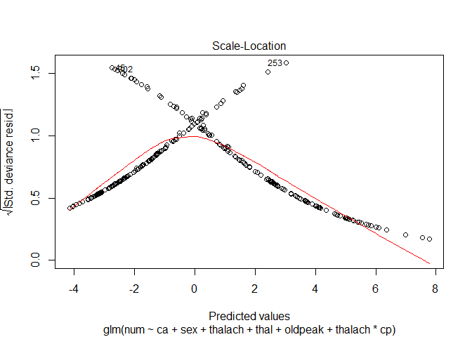<!-- -->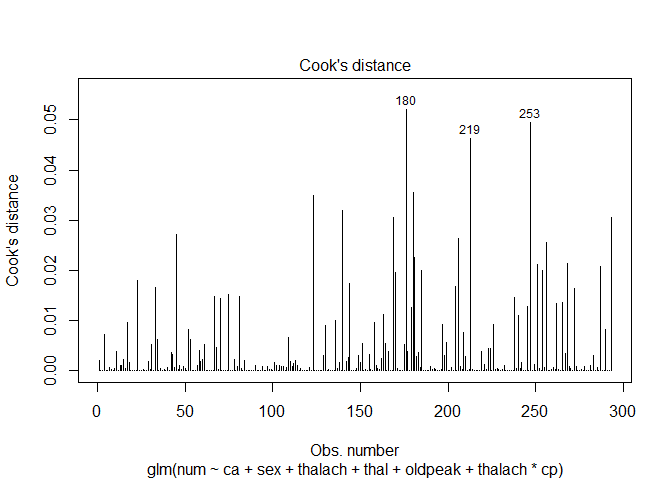<!-- -->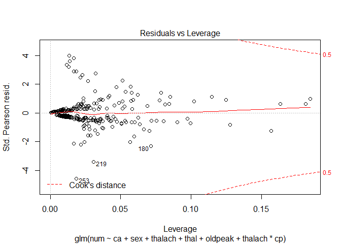<!-- -->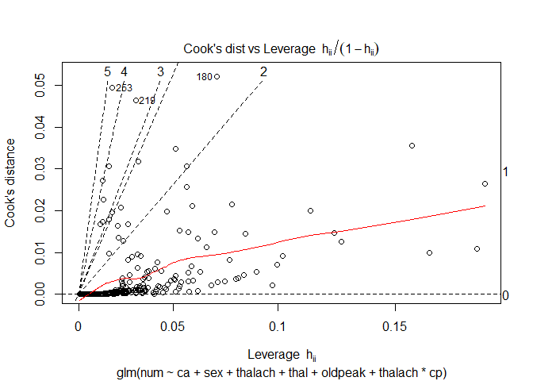<!-- -->

``` r
library(caret)
```

    ## Loading required package: lattice

    ## Loading required package: ggplot2

    ## Registered S3 methods overwritten by 'ggplot2':
    ##   method         from 
    ##   [.quosures     rlang
    ##   c.quosures     rlang
    ##   print.quosures rlang

``` r
set.seed(30)
inTrainRows <- createDataPartition(heart.data[-c(200, 299,177,93),]$num,p=.8,list=FALSE)
trainData <- heart.data[inTrainRows,]
testData <-  heart.data[-inTrainRows,]
nrow(trainData)/(nrow(testData)+nrow(trainData)) #checking whether really 70% -> O
```

    ## [1] 0.7920792

``` r
summary(trainData)
```

    ##       age             sex               cp           trestbps    
    ##  Min.   :34.00   Min.   :0.0000   Min.   :1.000   Min.   : 94.0  
    ##  1st Qu.:48.00   1st Qu.:0.0000   1st Qu.:3.000   1st Qu.:120.0  
    ##  Median :56.00   Median :1.0000   Median :3.500   Median :130.0  
    ##  Mean   :54.66   Mean   :0.6875   Mean   :3.183   Mean   :131.7  
    ##  3rd Qu.:61.00   3rd Qu.:1.0000   3rd Qu.:4.000   3rd Qu.:140.0  
    ##  Max.   :77.00   Max.   :1.0000   Max.   :4.000   Max.   :180.0  
    ##                                                                  
    ##       chol            fbs            restecg     thalach     
    ##  Min.   :141.0   Min.   :0.0000   Min.   :0   Min.   : 71.0  
    ##  1st Qu.:211.0   1st Qu.:0.0000   1st Qu.:0   1st Qu.:132.0  
    ##  Median :240.0   Median :0.0000   Median :1   Median :152.0  
    ##  Mean   :246.7   Mean   :0.1417   Mean   :1   Mean   :148.4  
    ##  3rd Qu.:274.0   3rd Qu.:0.0000   3rd Qu.:2   3rd Qu.:164.0  
    ##  Max.   :564.0   Max.   :1.0000   Max.   :2   Max.   :194.0  
    ##                                                              
    ##      exang           oldpeak          slope             ca        
    ##  Min.   :0.0000   Min.   :0.000   Min.   :1.000   Min.   :0.0000  
    ##  1st Qu.:0.0000   1st Qu.:0.000   1st Qu.:1.000   1st Qu.:0.0000  
    ##  Median :0.0000   Median :0.800   Median :2.000   Median :0.0000  
    ##  Mean   :0.3375   Mean   :1.042   Mean   :1.596   Mean   :0.6849  
    ##  3rd Qu.:1.0000   3rd Qu.:1.650   3rd Qu.:2.000   3rd Qu.:1.0000  
    ##  Max.   :1.0000   Max.   :6.200   Max.   :3.000   Max.   :3.0000  
    ##                                                   NA's   :2       
    ##       thal           num        
    ##  Min.   :3.00   Min.   :0.0000  
    ##  1st Qu.:3.00   1st Qu.:0.0000  
    ##  Median :3.00   Median :0.0000  
    ##  Mean   :4.77   Mean   :0.4625  
    ##  3rd Qu.:7.00   3rd Qu.:1.0000  
    ##  Max.   :7.00   Max.   :1.0000  
    ##  NA's   :1

``` r
mdl2 = glm(num ~ ca + sex + thalach + thal + oldpeak + thalach * cp,data = trainData , family = binomial)
glm.probs1=predict(mdl2, testData, type = "response")
summary(mdl2)
```

    ## 
    ## Call:
    ## glm(formula = num ~ ca + sex + thalach + thal + oldpeak + thalach * 
    ##     cp, family = binomial, data = trainData)
    ## 
    ## Deviance Residuals: 
    ##     Min       1Q   Median       3Q      Max  
    ## -2.7040  -0.5244  -0.2432   0.4780   2.4080  
    ## 
    ## Coefficients:
    ##              Estimate Std. Error z value Pr(>|z|)    
    ## (Intercept) -0.054250   4.970298  -0.011  0.99129    
    ## ca           0.929223   0.240319   3.867  0.00011 ***
    ## sex          1.195831   0.462970   2.583  0.00980 ** 
    ## thalach     -0.038813   0.032655  -1.189  0.23460    
    ## thal         0.410088   0.105077   3.903 9.51e-05 ***
    ## oldpeak      0.463014   0.190099   2.436  0.01487 *  
    ## cp           0.040984   1.435819   0.029  0.97723    
    ## thalach:cp   0.003516   0.009518   0.369  0.71181    
    ## ---
    ## Signif. codes:  0 '***' 0.001 '**' 0.01 '*' 0.05 '.' 0.1 ' ' 1
    ## 
    ## (Dispersion parameter for binomial family taken to be 1)
    ## 
    ##     Null deviance: 327.03  on 236  degrees of freedom
    ## Residual deviance: 174.81  on 229  degrees of freedom
    ##   (3 observations deleted due to missingness)
    ## AIC: 190.81
    ## 
    ## Number of Fisher Scoring iterations: 5

``` r
mdl3 = glm(num ~ cp + ca + sex  + thal + oldpeak + thalach * exang,data = trainData , family = binomial)
glm.probs2=predict(mdl3, testData, type = "response")
summary(mdl3)
```

    ## 
    ## Call:
    ## glm(formula = num ~ cp + ca + sex + thal + oldpeak + thalach * 
    ##     exang, family = binomial, data = trainData)
    ## 
    ## Deviance Residuals: 
    ##     Min       1Q   Median       3Q      Max  
    ## -2.5745  -0.5239  -0.2512   0.4719   2.4515  
    ## 
    ## Coefficients:
    ##                Estimate Std. Error z value Pr(>|z|)    
    ## (Intercept)   -2.137195   1.956365  -1.092 0.274643    
    ## cp             0.494450   0.204325   2.420 0.015524 *  
    ## ca             0.919758   0.237272   3.876 0.000106 ***
    ## sex            1.114171   0.474393   2.349 0.018843 *  
    ## thal           0.390543   0.107637   3.628 0.000285 ***
    ## oldpeak        0.416809   0.190953   2.183 0.029052 *  
    ## thalach       -0.023470   0.011343  -2.069 0.038531 *  
    ## exang          1.300095   3.061104   0.425 0.671045    
    ## thalach:exang -0.004549   0.020731  -0.219 0.826327    
    ## ---
    ## Signif. codes:  0 '***' 0.001 '**' 0.01 '*' 0.05 '.' 0.1 ' ' 1
    ## 
    ## (Dispersion parameter for binomial family taken to be 1)
    ## 
    ##     Null deviance: 327.03  on 236  degrees of freedom
    ## Residual deviance: 172.86  on 228  degrees of freedom
    ##   (3 observations deleted due to missingness)
    ## AIC: 190.86
    ## 
    ## Number of Fisher Scoring iterations: 5

``` r
cutoff_glm_final1 <- ifelse (glm.probs1 > .5, 1, 0)
cutoff_glm_final2 <- ifelse (glm.probs2 > .5, 1, 0)

tbl_glm_final1<- table(testData$num,cutoff_glm_final1)
tbl_glm_final2<- table(testData$num,cutoff_glm_final2)


#Classification accuracy=(TP+TN)/(TP+FP+TN+FN)#

glm_final_accuracy1 <- sum(diag(tbl_glm_final1)) / nrow(testData)
glm_final_accuracy2 <- sum(diag(tbl_glm_final2)) / nrow(testData)
glm_final_accuracy1
```

    ## [1] 0.7619048

``` r
glm_final_accuracy2
```

    ## [1] 0.8095238

Accuracy is 84.12%
