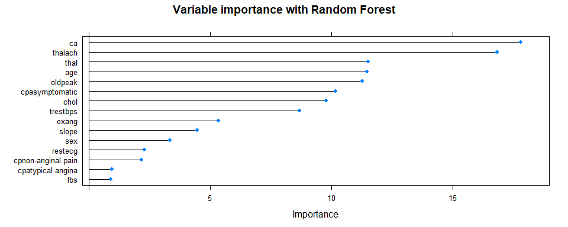
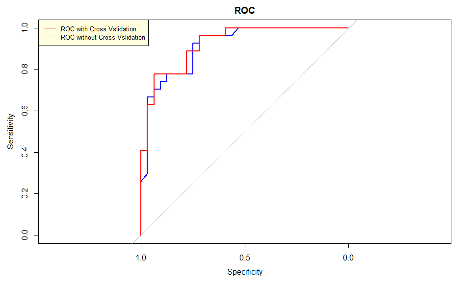

Random Forest
================
Tapas Mishra
21/05/2019

Let us evaluate a Random Forest model. In this module, we would be
trying a default random forest model and then perform cross validation.
We would evaluate models on performance indicators.

We would also look for feature importance ranking plot by Random forest.

``` r
library(caret)
```

    ## Loading required package: lattice

    ## Loading required package: ggplot2

    ## Registered S3 methods overwritten by 'ggplot2':
    ##   method         from 
    ##   [.quosures     rlang
    ##   c.quosures     rlang
    ##   print.quosures rlang

``` r
heart.data <- read.csv("https://archive.ics.uci.edu/ml/machine-learning-databases/heart-disease/processed.cleveland.data",header=FALSE,sep=",",na.strings = '?')
names(heart.data) <- c( "age", "sex", "cp", "trestbps", "chol","fbs", "restecg",
                   "thalach","exang", "oldpeak","slope", "ca", "thal", "target")

#Removing few missing values
heart.data <- na.omit(heart.data)

# creating chest pain as a factor
heart.data$cp <- factor(heart.data$cp,
                    levels = c(1,2,3,4),
                    labels = c("typical angina", "atypical angina","non-anginal pain","asymptomatic"))


# transforming target variable into binary 
heart.data$target[heart.data$target > 0] <- 1

#Converting target variable into factor
heart.data$target <- factor(heart.data$target,
                    levels = c(0,1),
                    labels = c("No", "Yes"))

summary(heart.data)
```

    ##       age             sex                        cp         trestbps    
    ##  Min.   :29.00   Min.   :0.0000   typical angina  : 23   Min.   : 94.0  
    ##  1st Qu.:48.00   1st Qu.:0.0000   atypical angina : 49   1st Qu.:120.0  
    ##  Median :56.00   Median :1.0000   non-anginal pain: 83   Median :130.0  
    ##  Mean   :54.54   Mean   :0.6768   asymptomatic    :142   Mean   :131.7  
    ##  3rd Qu.:61.00   3rd Qu.:1.0000                          3rd Qu.:140.0  
    ##  Max.   :77.00   Max.   :1.0000                          Max.   :200.0  
    ##       chol            fbs            restecg          thalach     
    ##  Min.   :126.0   Min.   :0.0000   Min.   :0.0000   Min.   : 71.0  
    ##  1st Qu.:211.0   1st Qu.:0.0000   1st Qu.:0.0000   1st Qu.:133.0  
    ##  Median :243.0   Median :0.0000   Median :1.0000   Median :153.0  
    ##  Mean   :247.4   Mean   :0.1448   Mean   :0.9966   Mean   :149.6  
    ##  3rd Qu.:276.0   3rd Qu.:0.0000   3rd Qu.:2.0000   3rd Qu.:166.0  
    ##  Max.   :564.0   Max.   :1.0000   Max.   :2.0000   Max.   :202.0  
    ##      exang           oldpeak          slope             ca        
    ##  Min.   :0.0000   Min.   :0.000   Min.   :1.000   Min.   :0.0000  
    ##  1st Qu.:0.0000   1st Qu.:0.000   1st Qu.:1.000   1st Qu.:0.0000  
    ##  Median :0.0000   Median :0.800   Median :2.000   Median :0.0000  
    ##  Mean   :0.3266   Mean   :1.056   Mean   :1.603   Mean   :0.6768  
    ##  3rd Qu.:1.0000   3rd Qu.:1.600   3rd Qu.:2.000   3rd Qu.:1.0000  
    ##  Max.   :1.0000   Max.   :6.200   Max.   :3.000   Max.   :3.0000  
    ##       thal       target   
    ##  Min.   :3.000   No :160  
    ##  1st Qu.:3.000   Yes:137  
    ##  Median :3.000            
    ##  Mean   :4.731            
    ##  3rd Qu.:7.000            
    ##  Max.   :7.000

First we divide the dataset into training and test dataset.

``` r
library(caret)
seed <- 7
inTrainRows <- createDataPartition(heart.data$target,p=.8,list=FALSE)
trainData <- heart.data[inTrainRows,]
testData <-  heart.data[-inTrainRows,]
nrow(trainData)/(nrow(testData)+nrow(trainData)) #checking whether really 70% -> O
```

    ## [1] 0.8013468

``` r
summary(trainData)
```

    ##       age             sex                        cp         trestbps    
    ##  Min.   :29.00   Min.   :0.0000   typical angina  : 17   Min.   : 94.0  
    ##  1st Qu.:48.00   1st Qu.:0.0000   atypical angina : 39   1st Qu.:120.0  
    ##  Median :56.00   Median :1.0000   non-anginal pain: 63   Median :130.0  
    ##  Mean   :54.47   Mean   :0.6975   asymptomatic    :119   Mean   :131.8  
    ##  3rd Qu.:61.00   3rd Qu.:1.0000                          3rd Qu.:140.0  
    ##  Max.   :77.00   Max.   :1.0000                          Max.   :200.0  
    ##       chol            fbs            restecg         thalach     
    ##  Min.   :126.0   Min.   :0.0000   Min.   :0.000   Min.   : 71.0  
    ##  1st Qu.:211.2   1st Qu.:0.0000   1st Qu.:0.000   1st Qu.:133.2  
    ##  Median :243.5   Median :0.0000   Median :1.000   Median :153.5  
    ##  Mean   :249.3   Mean   :0.1303   Mean   :1.008   Mean   :150.0  
    ##  3rd Qu.:281.8   3rd Qu.:0.0000   3rd Qu.:2.000   3rd Qu.:165.8  
    ##  Max.   :564.0   Max.   :1.0000   Max.   :2.000   Max.   :202.0  
    ##      exang           oldpeak          slope             ca        
    ##  Min.   :0.0000   Min.   :0.000   Min.   :1.000   Min.   :0.0000  
    ##  1st Qu.:0.0000   1st Qu.:0.000   1st Qu.:1.000   1st Qu.:0.0000  
    ##  Median :0.0000   Median :0.800   Median :2.000   Median :0.0000  
    ##  Mean   :0.3235   Mean   :1.044   Mean   :1.601   Mean   :0.6807  
    ##  3rd Qu.:1.0000   3rd Qu.:1.600   3rd Qu.:2.000   3rd Qu.:1.0000  
    ##  Max.   :1.0000   Max.   :6.200   Max.   :3.000   Max.   :3.0000  
    ##       thal       target   
    ##  Min.   :3.000   No :128  
    ##  1st Qu.:3.000   Yes:110  
    ##  Median :3.000            
    ##  Mean   :4.739            
    ##  3rd Qu.:7.000            
    ##  Max.   :7.000

we create a simple Random Forest model , with all default parameters.

``` r
library(randomForest)
```

    ## randomForest 4.6-14

    ## Type rfNews() to see new features/changes/bug fixes.

    ## 
    ## Attaching package: 'randomForest'

    ## The following object is masked from 'package:ggplot2':
    ## 
    ##     margin

``` r
RFModel <- randomForest(target ~ .,
                    data=trainData)

print(RFModel)
```

    ## 
    ## Call:
    ##  randomForest(formula = target ~ ., data = trainData) 
    ##                Type of random forest: classification
    ##                      Number of trees: 500
    ## No. of variables tried at each split: 3
    ## 
    ##         OOB estimate of  error rate: 17.23%
    ## Confusion matrix:
    ##      No Yes class.error
    ## No  114  14   0.1093750
    ## Yes  27  83   0.2454545

Predictions using default random forest model.

``` r
library(pROC)
```

    ## Type 'citation("pROC")' for a citation.

    ## 
    ## Attaching package: 'pROC'

    ## The following objects are masked from 'package:stats':
    ## 
    ##     cov, smooth, var

``` r
#varImpPlot(RFModel)
RFPrediction <- predict(RFModel, testData)
RFPredictionprob = predict(RFModel,testData,type="prob")[, 2]

RFConfMat <- confusionMatrix(RFPrediction, testData[,"target"])
RFConfMat
```

    ## Confusion Matrix and Statistics
    ## 
    ##           Reference
    ## Prediction No Yes
    ##        No  28   7
    ##        Yes  4  20
    ##                                           
    ##                Accuracy : 0.8136          
    ##                  95% CI : (0.6909, 0.9031)
    ##     No Information Rate : 0.5424          
    ##     P-Value [Acc > NIR] : 1.224e-05       
    ##                                           
    ##                   Kappa : 0.6211          
    ##                                           
    ##  Mcnemar's Test P-Value : 0.5465          
    ##                                           
    ##             Sensitivity : 0.8750          
    ##             Specificity : 0.7407          
    ##          Pos Pred Value : 0.8000          
    ##          Neg Pred Value : 0.8333          
    ##              Prevalence : 0.5424          
    ##          Detection Rate : 0.4746          
    ##    Detection Prevalence : 0.5932          
    ##       Balanced Accuracy : 0.8079          
    ##                                           
    ##        'Positive' Class : No              
    ## 

``` r
AUC <- roc(as.numeric(testData$target),as.numeric(as.matrix((RFPredictionprob))))$auc
Accuracy <- RFConfMat$overall['Accuracy'] 
```

Creating other performance indicators.

``` r
precision = 26/32
recall = 26/31
F1 = (2 * precision *recall) / (recall + precision)
precision
```

    ## [1] 0.8125

``` r
recall
```

    ## [1] 0.8387097

``` r
F1
```

    ## [1] 0.8253968

``` r
AUC
```

    ## Area under the curve: 0.9132

``` r
Accuracy
```

    ##  Accuracy 
    ## 0.8135593

No performing repeated cross validation with 10 folds and 3 repeats . We
also optimize mtry parameter using gridsearch.

``` r
library(randomForest)
# Create model with default paramters
control <- trainControl(method="repeatedcv", number=10, repeats=3)
seed <- 10
metric <- "Accuracy"
set.seed(seed)
mtry <- sqrt(ncol(trainData))
tunegrid <- expand.grid(.mtry=mtry)
rf_default <- train(target~., data=trainData, method="rf", metric=metric, tuneGrid=tunegrid, trControl=control)
print(rf_default)
```

    ## Random Forest 
    ## 
    ## 238 samples
    ##  13 predictor
    ##   2 classes: 'No', 'Yes' 
    ## 
    ## No pre-processing
    ## Resampling: Cross-Validated (10 fold, repeated 3 times) 
    ## Summary of sample sizes: 214, 214, 214, 214, 214, 215, ... 
    ## Resampling results:
    ## 
    ##   Accuracy   Kappa    
    ##   0.8323671  0.6597497
    ## 
    ## Tuning parameter 'mtry' was held constant at a value of 3.741657

creating a random forest feature importance.

``` r
boostImp =varImp(rf_default, scale = FALSE)
plot(boostImp,main = 'Variable importance with Random Forest')
```

<!-- -->

Predictions using cross validation model

``` r
RFPrediction_cv <- predict(rf_default, testData)
RFConfMat_cv <- confusionMatrix(RFPrediction_cv, testData[,"target"])
RFPredictionprob_cv = predict(rf_default,testData,type="prob")[, 2]
RFConfMat_cv
```

    ## Confusion Matrix and Statistics
    ## 
    ##           Reference
    ## Prediction No Yes
    ##        No  29   6
    ##        Yes  3  21
    ##                                           
    ##                Accuracy : 0.8475          
    ##                  95% CI : (0.7301, 0.9278)
    ##     No Information Rate : 0.5424          
    ##     P-Value [Acc > NIR] : 7.195e-07       
    ##                                           
    ##                   Kappa : 0.69            
    ##                                           
    ##  Mcnemar's Test P-Value : 0.505           
    ##                                           
    ##             Sensitivity : 0.9062          
    ##             Specificity : 0.7778          
    ##          Pos Pred Value : 0.8286          
    ##          Neg Pred Value : 0.8750          
    ##              Prevalence : 0.5424          
    ##          Detection Rate : 0.4915          
    ##    Detection Prevalence : 0.5932          
    ##       Balanced Accuracy : 0.8420          
    ##                                           
    ##        'Positive' Class : No              
    ## 

``` r
AUC_cv <- roc(as.numeric(testData$target),as.numeric(as.matrix((RFPredictionprob_cv))))$auc
Accuracy_cv <- RFConfMat_cv$overall['Accuracy'] 
```

``` r
precision_cv = 28/32
recall_cv = 28/34
F1_cv = (2 * precision_cv *recall_cv) / (recall_cv + precision_cv)
precision_cv
```

    ## [1] 0.875

``` r
recall_cv
```

    ## [1] 0.8235294

``` r
F1_cv
```

    ## [1] 0.8484848

``` r
AUC_cv
```

    ## Area under the curve: 0.9236

``` r
Accuracy_cv
```

    ##  Accuracy 
    ## 0.8474576

Creating ROC curve for 2 models

``` r
library(pROC)


result.roc_cv <- roc(testData$target, RFPredictionprob_cv) # Draw ROC curve.
result.roc <- roc(testData$target, RFPredictionprob) # Draw ROC curve.
plot(result.roc , main = "ROC",col="blue")
plot(result.roc_cv , col= "red",add=TRUE)
legend("topleft",col=c("red", "blue"), legend= c("ROC with Cross Vslidation", "ROC without Cross Vslidation"),        lty=1, cex=0.8,bg='lightyellow') 
```

<!-- -->

1
