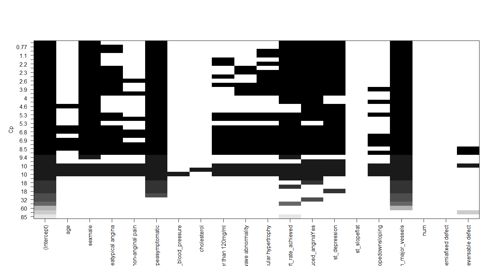

Variable Selection from Heart Disease Data
================
Tapas Mishra
16 April 2019

``` r
# Load the data

heart.data <- read.csv("https://archive.ics.uci.edu/ml/machine-learning-databases/heart-disease/processed.cleveland.data",header=FALSE,sep=",",na.strings = '?')
names(heart.data) <- c( "age", "sex", "chest_pain_type", "resting_blood_pressure", "cholesterol","fasting_blood_sugar", "rest_ecg",
                   "max_heart_rate_achieved","exercise_induced_angina", "st_depression","st_slope", "num_major_vessels", "thalassemia", "target")

summary(heart.data)
```

    ##       age             sex         chest_pain_type resting_blood_pressure
    ##  Min.   :29.00   Min.   :0.0000   Min.   :1.000   Min.   : 94.0         
    ##  1st Qu.:48.00   1st Qu.:0.0000   1st Qu.:3.000   1st Qu.:120.0         
    ##  Median :56.00   Median :1.0000   Median :3.000   Median :130.0         
    ##  Mean   :54.44   Mean   :0.6799   Mean   :3.158   Mean   :131.7         
    ##  3rd Qu.:61.00   3rd Qu.:1.0000   3rd Qu.:4.000   3rd Qu.:140.0         
    ##  Max.   :77.00   Max.   :1.0000   Max.   :4.000   Max.   :200.0         
    ##                                                                         
    ##   cholesterol    fasting_blood_sugar    rest_ecg     
    ##  Min.   :126.0   Min.   :0.0000      Min.   :0.0000  
    ##  1st Qu.:211.0   1st Qu.:0.0000      1st Qu.:0.0000  
    ##  Median :241.0   Median :0.0000      Median :1.0000  
    ##  Mean   :246.7   Mean   :0.1485      Mean   :0.9901  
    ##  3rd Qu.:275.0   3rd Qu.:0.0000      3rd Qu.:2.0000  
    ##  Max.   :564.0   Max.   :1.0000      Max.   :2.0000  
    ##                                                      
    ##  max_heart_rate_achieved exercise_induced_angina st_depression 
    ##  Min.   : 71.0           Min.   :0.0000          Min.   :0.00  
    ##  1st Qu.:133.5           1st Qu.:0.0000          1st Qu.:0.00  
    ##  Median :153.0           Median :0.0000          Median :0.80  
    ##  Mean   :149.6           Mean   :0.3267          Mean   :1.04  
    ##  3rd Qu.:166.0           3rd Qu.:1.0000          3rd Qu.:1.60  
    ##  Max.   :202.0           Max.   :1.0000          Max.   :6.20  
    ##                                                                
    ##     st_slope     num_major_vessels  thalassemia        target      
    ##  Min.   :1.000   Min.   :0.0000    Min.   :3.000   Min.   :0.0000  
    ##  1st Qu.:1.000   1st Qu.:0.0000    1st Qu.:3.000   1st Qu.:0.0000  
    ##  Median :2.000   Median :0.0000    Median :3.000   Median :0.0000  
    ##  Mean   :1.601   Mean   :0.6722    Mean   :4.734   Mean   :0.9373  
    ##  3rd Qu.:2.000   3rd Qu.:1.0000    3rd Qu.:7.000   3rd Qu.:2.0000  
    ##  Max.   :3.000   Max.   :3.0000    Max.   :7.000   Max.   :4.0000  
    ##                  NA's   :4         NA's   :2

I’m also going to change the values of the categorical variables, to
improve the interpretation later on,

``` r
heart.data$sex <- factor(heart.data$sex,
                    levels = c(0,1),
                    labels = c("female", "male"))

heart.data$chest_pain_type <- factor(heart.data$chest_pain_type,
                    levels = c(1,2,3,4),
                    labels = c("typical angina", "atypical angina","non-anginal pain","asymptomatic"))


heart.data$fasting_blood_sugar <- factor(heart.data$fasting_blood_sugar,
                    levels = c(0,1),
                    labels = c("lower than 120mg/ml", "greater than 120mg/ml"))

heart.data$rest_ecg <- factor(heart.data$rest_ecg,
                    levels = c(0,1,2),
                    labels = c("normal", "ST-T wave abnormality","left ventricular hypertrophy"))

heart.data$exercise_induced_angina <- factor(heart.data$exercise_induced_angina,
                    levels = c(0,1),
                    labels = c("No", "Yes"))

heart.data$st_slope <- factor(heart.data$st_slope,
                    levels = c(1,2,3),
                    labels = c("upsloping", "flat","downsloping"))

heart.data$thalassemia <- factor(heart.data$thalassemia,
                    levels = c(1,2,3),
                    labels = c("normal", "fixed defect","reversable defect"))
```

Check the data now ..

``` r
str(heart.data)
```

    ## 'data.frame':    303 obs. of  14 variables:
    ##  $ age                    : num  63 67 67 37 41 56 62 57 63 53 ...
    ##  $ sex                    : Factor w/ 2 levels "female","male": 2 2 2 2 1 2 1 1 2 2 ...
    ##  $ chest_pain_type        : Factor w/ 4 levels "typical angina",..: 1 4 4 3 2 2 4 4 4 4 ...
    ##  $ resting_blood_pressure : num  145 160 120 130 130 120 140 120 130 140 ...
    ##  $ cholesterol            : num  233 286 229 250 204 236 268 354 254 203 ...
    ##  $ fasting_blood_sugar    : Factor w/ 2 levels "lower than 120mg/ml",..: 2 1 1 1 1 1 1 1 1 2 ...
    ##  $ rest_ecg               : Factor w/ 3 levels "normal","ST-T wave abnormality",..: 3 3 3 1 3 1 3 1 3 3 ...
    ##  $ max_heart_rate_achieved: num  150 108 129 187 172 178 160 163 147 155 ...
    ##  $ exercise_induced_angina: Factor w/ 2 levels "No","Yes": 1 2 2 1 1 1 1 2 1 2 ...
    ##  $ st_depression          : num  2.3 1.5 2.6 3.5 1.4 0.8 3.6 0.6 1.4 3.1 ...
    ##  $ st_slope               : Factor w/ 3 levels "upsloping","flat",..: 3 2 2 3 1 1 3 1 2 3 ...
    ##  $ num_major_vessels      : num  0 3 2 0 0 0 2 0 1 0 ...
    ##  $ thalassemia            : Factor w/ 3 levels "normal","fixed defect",..: NA 3 NA 3 3 3 3 3 NA NA ...
    ##  $ target                 : int  0 2 1 0 0 0 3 0 2 1 ...

``` r
library(vioplot)
```

    ## Loading required package: sm

    ## Package 'sm', version 2.2-5.6: type help(sm) for summary information

    ## Loading required package: zoo

    ## 
    ## Attaching package: 'zoo'

    ## The following objects are masked from 'package:base':
    ## 
    ##     as.Date, as.Date.numeric

``` r
par(mfrow = c(3,2))
with(heart.data,vioplot(age,names="Age",horizontal=TRUE, col = "orange", main = "Distribution of Age"))
with(heart.data,vioplot(resting_blood_pressure ,names="Resting Blood Pressure",horizontal=TRUE, col = "orange", main = "Distribution of Resting Blood Pressure"))
with(heart.data,vioplot(cholesterol             ,names="Cholesterol",horizontal=TRUE, col = "orange", main = "Distribution of Cholesterol"))
with(heart.data,vioplot(max_heart_rate_achieved ,names="Maximum Heart Rate Achieved",horizontal=TRUE, col = "orange", main = "Distribution of Maximum Heart Rate Achieved"))
with(heart.data,vioplot(st_depression           ,names="ST Depression",horizontal=TRUE, col = "orange",main = "Distribution of ST Depression"))
```

<!-- -->

Creating a pair plot

``` r
plot(heart.data)
```

<!-- -->

Checking the
    multicollinearity

``` r
round(diag(solve(cor(heart.data[,c(1,4,5,8,10)]))),2)
```

    ##                     age  resting_blood_pressure             cholesterol 
    ##                    1.35                    1.13                    1.06 
    ## max_heart_rate_achieved           st_depression 
    ##                    1.32                    1.17

``` r
heart.data$num[heart.data$num > 0] <- 1
```

``` r
library(leaps)
subsets.out<-regsubsets(target~.,data=heart.data,nbest=1)
```

    ## Warning in leaps.setup(x, y, wt = wt, nbest = nbest, nvmax = nvmax,
    ## force.in = force.in, : 2 linear dependencies found

    ## Reordering variables and trying again:

``` r
sso<-summary(subsets.out)


my.table<-cbind(sso$outmat,round(sso$rss,2),round(sso$cp,2),round(sso$bic,2))


colnames(my.table)[14:15]<-c("Cp","BIC")
print.table( my.table)
```

    ##          age sexmale chest_pain_typeatypical angina
    ## 1  ( 1 )                                           
    ## 2  ( 1 )                                           
    ## 3  ( 1 )                                           
    ## 4  ( 1 )     *                                     
    ## 5  ( 1 )     *                                     
    ## 6  ( 1 )     *                                     
    ## 7  ( 1 )     *       *                             
    ## 8  ( 1 )     *       *                             
    ## 9  ( 1 )     *       *                             
    ##          chest_pain_typenon-anginal pain chest_pain_typeasymptomatic
    ## 1  ( 1 )                                                            
    ## 2  ( 1 )                                 *                          
    ## 3  ( 1 )                                 *                          
    ## 4  ( 1 )                                 *                          
    ## 5  ( 1 )                                 *                          
    ## 6  ( 1 )                                 *                          
    ## 7  ( 1 )                                 *                          
    ## 8  ( 1 )                                 *                          
    ## 9  ( 1 )                                 *                          
    ##          resting_blood_pressure cholesterol
    ## 1  ( 1 )                                   
    ## 2  ( 1 )                                   
    ## 3  ( 1 )                                   
    ## 4  ( 1 )                                   
    ## 5  ( 1 )                                   
    ## 6  ( 1 )                                   
    ## 7  ( 1 )                                   
    ## 8  ( 1 )                                   
    ## 9  ( 1 )                                   
    ##          fasting_blood_sugargreater than 120mg/ml
    ## 1  ( 1 )                                         
    ## 2  ( 1 )                                         
    ## 3  ( 1 )                                         
    ## 4  ( 1 )                                         
    ## 5  ( 1 )                                         
    ## 6  ( 1 )                                         
    ## 7  ( 1 )                                         
    ## 8  ( 1 )                                         
    ## 9  ( 1 )                                         
    ##          rest_ecgST-T wave abnormality
    ## 1  ( 1 )                              
    ## 2  ( 1 )                              
    ## 3  ( 1 )                              
    ## 4  ( 1 )                              
    ## 5  ( 1 )                              
    ## 6  ( 1 )                              
    ## 7  ( 1 )                              
    ## 8  ( 1 )                              
    ## 9  ( 1 ) *                            
    ##          rest_ecgleft ventricular hypertrophy max_heart_rate_achieved
    ## 1  ( 1 )                                                             
    ## 2  ( 1 )                                                             
    ## 3  ( 1 )                                                             
    ## 4  ( 1 )                                      *                      
    ## 5  ( 1 )                                      *                      
    ## 6  ( 1 )                                      *                      
    ## 7  ( 1 )                                      *                      
    ## 8  ( 1 ) *                                    *                      
    ## 9  ( 1 ) *                                    *                      
    ##          exercise_induced_anginaYes st_depression Cp BIC num_major_vessels
    ## 1  ( 1 )                                                 *                
    ## 2  ( 1 )                                                 *                
    ## 3  ( 1 ) *                                               *                
    ## 4  ( 1 )                                                 *                
    ## 5  ( 1 ) *                                               *                
    ## 6  ( 1 ) *                          *                    *                
    ## 7  ( 1 ) *                          *                    *                
    ## 8  ( 1 ) *                          *                    *                
    ## 9  ( 1 ) *                          *                    *                
    ##          thalassemiafixed defect thalassemiareversable defect num      
    ## 1  ( 1 )                                                          84.04
    ## 2  ( 1 )                                                          71.58
    ## 3  ( 1 )                                                          66.44
    ## 4  ( 1 )                                                          62.41
    ## 5  ( 1 )                                                          59.6 
    ## 6  ( 1 )                                                          57.57
    ## 7  ( 1 )                                                          56.84
    ## 8  ( 1 )                                                          56.2 
    ## 9  ( 1 )                                                          55.91
    ##                      
    ## 1  ( 1 ) 59.98 -37.72
    ## 2  ( 1 ) 29.37 -58.93
    ## 3  ( 1 ) 17.92 -66.05
    ## 4  ( 1 ) 9.36  -71.22
    ## 5  ( 1 ) 4.01  -73.67
    ## 6  ( 1 ) 0.7   -74.25
    ## 7  ( 1 ) 0.77  -71.26
    ## 8  ( 1 ) 1.1   -68.02
    ## 9  ( 1 ) 2.34  -63.76

``` r
subsets2.out<-regsubsets(target~.,data=heart.data,nbest=3, nvmax = 13)
```

    ## Warning in leaps.setup(x, y, wt = wt, nbest = nbest, nvmax = nvmax,
    ## force.in = force.in, : 2 linear dependencies found

    ## Reordering variables and trying again:

``` r
plot(subsets2.out,scale="Cp")
```

<!-- -->

``` r
plot(subsets2.out,scale="bic")
```

<!-- -->
